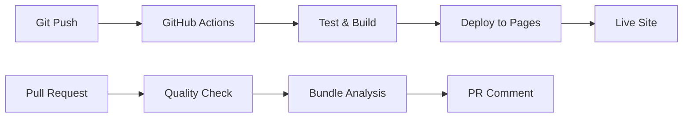

# 🚀 Automated CI/CD Pipeline

Your portfolio now has a **fully automated deployment pipeline** that deploys to GitHub Pages on every commit!

## 🔄 **How It Works**

### **1. Automatic Deployment (Main Branch)**
- **Trigger**: Every push to `main` or `master` branch
- **Process**: 
  1. ✅ Run tests (TypeScript, Linting)
  2. 🔨 Build production bundle
  3. 🚀 Deploy to GitHub Pages
  4. 📊 Report deployment status

### **2. Quality Assurance (Pull Requests)**
- **Trigger**: Every pull request to `main` or `master`
- **Process**:
  1. ✅ Type checking
  2. 🔍 Linting
  3. 📦 Bundle analysis
  4. 💬 Comment with results

### **3. Security Monitoring (Weekly + PRs)**
- **Trigger**: Every Monday + PRs
- **Process**:
  1. 🔒 Security audit
  2. 📦 Dependency check
  3. 📊 Generate reports

## 📁 **Workflow Files**

| Workflow | Purpose | Trigger |
|----------|---------|---------|
| `deploy.yml` | 🚀 **Main Deployment** | Push to main branch |
| `quality.yml` | ✅ **Quality Check** | Pull requests |
| `security.yml` | 🔒 **Security & Dependencies** | Weekly + PRs |

## 🎯 **Deployment Flow**

## ⚡ **What Happens on Commit**

1. **Push to main branch** → Automatic deployment
2. **Create PR** → Quality checks + bundle analysis
3. **Merge PR** → Automatic deployment
4. **Weekly** → Security audit + dependency check

## 🛠️ **Manual Triggers**

You can manually trigger any workflow:

1. Go to **Actions** tab in your repository
2. Select the workflow you want to run
3. Click **Run workflow**
4. Choose branch and click **Run workflow**

## 📊 **Monitoring & Notifications**

### **Success Notifications**
- ✅ Build successful
- 🚀 Deployment complete
- 🌐 Site URL provided

### **Failure Notifications**
- ❌ Build failed
- 🔍 Error details
- 📋 Next steps

### **Quality Reports**
- 📦 Bundle size analysis
- 🔒 Security status
- 📊 Performance metrics

## 🔧 **Configuration**

### **Environment Variables**
- `NODE_ENV=production` for builds
- GitHub Pages permissions configured
- Node.js 18.x runtime

### **Caching**
- npm dependencies cached
- Build artifacts optimized
- Concurrency control enabled

## 🚨 **Troubleshooting**

### **Deployment Fails**
1. Check **Actions** tab for error logs
2. Verify GitHub Pages is enabled
3. Check repository permissions
4. Review build logs for specific errors

### **Quality Checks Fail**
1. Run `npm run ci:test` locally
2. Fix TypeScript errors: `npm run type-check`
3. Fix linting issues: `npm run lint:fix`
4. Check bundle size: `npm run build:analyze`

### **Security Issues**
1. Run `npm run security:audit`
2. Update dependencies: `npm update`
3. Fix vulnerabilities: `npm run security:fix`

## 📈 **Performance Metrics**

### **Bundle Size Targets**
- **JS**: < 60 KB gzipped ✅
- **CSS**: < 50 KB gzipped ✅
- **Total**: < 1 MB ✅

### **Build Time**
- **Dependencies**: ~30s (cached)
- **Build**: ~5s
- **Deploy**: ~2s
- **Total**: ~37s

## 🎉 **Benefits**

1. **🚀 Zero-touch deployment** - Just commit and push!
2. **✅ Quality gates** - Catch issues before they go live
3. **🔒 Security monitoring** - Stay updated on vulnerabilities
4. **📊 Performance tracking** - Monitor bundle sizes
5. **🔄 Rollback ready** - Previous builds kept warm
6. **🌐 Global CDN** - Fast loading worldwide

## 🔮 **Future Enhancements**

- [ ] Lighthouse CI integration
- [ ] Bundle size budgets
- [ ] Performance regression testing
- [ ] Automated accessibility checks
- [ ] SEO validation
- [ ] Cross-browser testing

---

**Status**: 🟢 **Fully Automated**
**Next Deployment**: On next commit to main branch
**Monitoring**: GitHub Actions + Repository notifications
